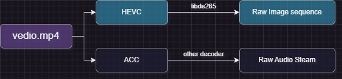

<div align="center">
  <p>
    <a href="https://github.com/Puiching-Memory/pylibde265" target="_blank">
      </a>
  </p>

<div>
    <a href=""></a>
    <br>
    <a href=""></a>
    <a href=""></a>
    <a href=""></a>
    <a href=""></a>
    <a href=""></a>
    <a href=""></a>
  </div>

  [中文](https://github.com/Puiching-Memory/pylibde265/blob/main/README_zh.md) | [English](https://github.com/Puiching-Memory/pylibde265/blob/main/README.md)

</div>

# pylibde265

Decode HEVC(H.265) video in python

在python中解码HEVC(H.265)视频

### Warning! This repository is still in early release, the code is subject to frequent disruptive changes, and we cannot guarantee compatibility with the current version

### 警告！此存储库仍处于早期版本，代码会经常有破坏性更改，我们无法保证目前版本的兼容性

# 概念

<div>
  <a href=""></a>
</div>

常见的视频文件，如.mp4是一类容器，其包含了视频流(HEVC编码)和音频流(ACC编码)数据。

libde265负责将HEVC编码的视频流解码至原始比特流，此类文件通常以.265或.hevc作为后缀名。

目前版本中，不支持直接解码.mp4文件，你需要手动分离视频文件的视频部分。

要想从MP4中提取h265流，你可以使用：ffmpeg,gpac(mp4box),Bento4

~~但是你都使用了这些框架了，那其实解码h265他们也能做~~

# 快速开始

```bash
pip install pylibde265
```

```python
import pylibde265.de265
import matplotlib.pyplot as plt
import os

# 初始化解码器 (指定线程数)
dec = pylibde265.de265.decoder(threads=os.cpu_count() or 1)

# 流式加载并解码 HEVC (.265/.hevc) 文件
for img in dec.load_file("your_video.h265"):
    print(f"Frame PTS: {img.pts}, {img.width()}x{img.height()}")
    
    # 获取原始 YUV 分量 (numpy 视图，无拷贝)
    # y, cb, cr = img.yuv()
    
    # 转换为 RGB (C++ 层加速，支持 420/422/444 和 8-12bit)
    rgb = img.to_rgb()
    
    plt.imshow(rgb)
    plt.show()
    break
```


## 核心 API 介绍

### `pylibde265.de265.decoder`
解码器核心类。
- `load_file(path)`: 生成器函数，逐帧读取并解码文件。
- `push_data(data)`: 向解码器压入二进制流数据。
- `decode()`: 执行解码过程并返回生成的图像生成器。

### `pylibde265.de265.Image`
解码后的图像对象。
- `width()`, `height()`: 图像尺寸。
- `pts`: 演示时间戳。
- `chroma_format`: 颜色格式 (4:2:0, 4:2:2, 4:4:4 等)。
- `yuv()`: 返回 `(Y, Cb, Cr)` 的 numpy 数组元组。
- `to_rgb()`: 高性能转换为 RGB 格式 (numpy 数组)。

## 高级用法：内存流处理

如果你正在处理来自网络或内存的流数据：

```python
dec = pylibde265.de265.decoder()
with open("stream.h265", "rb") as f:
    while True:
        chunk = f.read(4096)
        if not chunk: break
        
        dec.push_data(chunk)
        for img in dec.decode():
             # 处理图像
             process(img.to_rgb())
```

# 性能

* **高性能 C++ 核心**：所有的像素处理和颜色转换 (YUV to RGB) 已完全迁移至 C++ 层，利用 `pybind11` 实现零拷贝数据交换。
* **多线程支持**：充分利用 libde265 的多线程解码能力，在多核处理器上表现优异。
* **性能基准 (720p H.265)**：
    * **解码速度**: > 100 FPS (单帧耗时 ~8ms)。
    * **颜色转换**: ~6ms (C++ 加速，支持 4:2:0/4:2:2/4:4:4)。
    * **综合吞吐量**: 在 4 线程下可稳定达到 30+ FPS 的实时播放速率。

具体性能数据 (基于 `test/bench_performance.py`):

| 线程数 | 解码 (ms) | RGB 转换 (ms) | 综合 FPS |
| :----- | :-------- | :------------ | :------- |
| 1      | 73.18     | 6.20          | 12.6     |
| 4      | 27.64     | 5.72          | 30.0     |
| 16     | 22.19     | 5.79          | 35.7     |

# 从源代码构建

## 环境要求
- C++11 兼容编译器 (Windows: VS 2022 / GCC / Clang)
- CMake 3.15+
- Python 3.9+

## 使用 uv (推荐)

1. 克隆存储库：`git clone https://github.com/Puiching-Memory/pylibde265.git`
2. 安装依赖并自动构建：

```bash
# 创建并激活环境
uv venv
.venv\Scripts\activate

# 直接以开发模式安装 (会自动调用 CMake 编译 C++ 模块)
uv pip install -e .
```

## 使用标准 pip

```bash
pip install .
```

项目采用 `scikit-build-core` 构建系统，会自动处理子模块 `libde265` 的编译与链接，无需手动进入子目录构建。

# 路线图

* [x] **高性能 C++ 颜色转换**：支持多种采样格式和位深。
* [x] **流式数据加载**：支持 `push_data` 实时解码。
* [ ] **解复用器 (Demuxer)**：支持直接读取 .mp4 容器。
* [ ] **硬件加速解码**：集成 DXVA2/D3D11VA。


# 致谢

作者:

* @梦归云帆

参考:

* [libde265](https://github.com/strukturag/libde265)--C/C++仓库:作者[@strukturag](https://github.com/strukturag)
* [pyde265](https://github.com/kloppjp/pyde265)--提供linux系统的py绑定:作者[@kloppjp](https://github.com/kloppjp)

统计数据标签:

* https://dev.to/envoy_/150-badges-for-github-pnk
* https://shields.io/

数据分析:

* https://pypistats.org/packages/pylibde265
