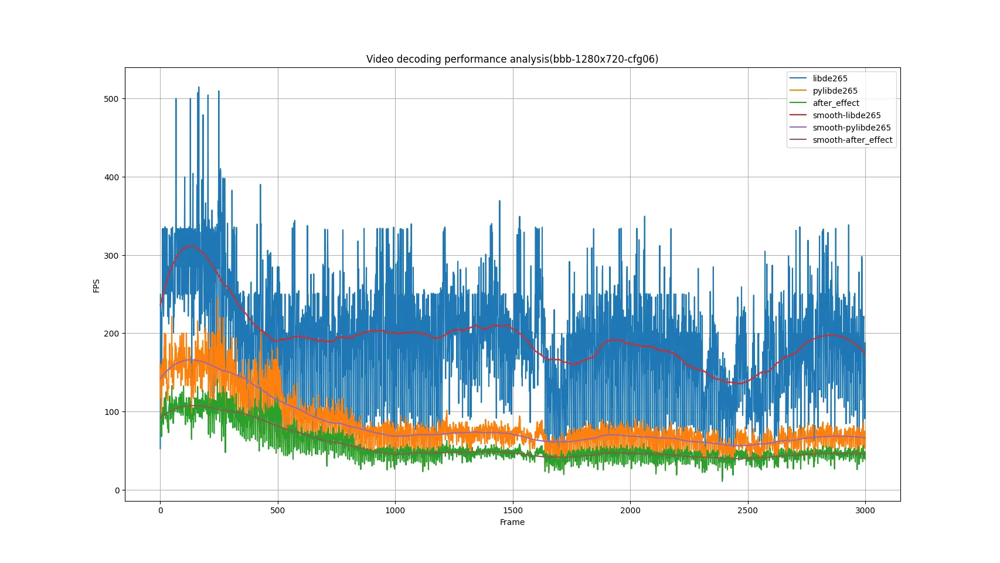

<div align="center">
  <p>
    <a href="https://github.com/Puiching-Memory/pylibde265" target="_blank">
      </a>
  </p>

<div>
    <a href=""></a>
    <br>
    <a href=""></a>
    <a href=""></a>
    <a href=""></a>
    <a href=""></a>
    <a href=""></a>
    <a href=""></a>
  </div>

  [中文](https://github.com/Puiching-Memory/pylibde265/blob/main/README_zh.md) | [English](https://github.com/Puiching-Memory/pylibde265/blob/main/README.md)

</div>

# pylibde265

Decode HEVC(H.265) video in python

在python中解码HEVC(H.265)视频

### Warning! This repository is still in early release, the code is subject to frequent disruptive changes, and we cannot guarantee compatibility with the current version

### 警告！此存储库仍处于早期版本，代码会经常有破坏性更改，我们无法保证目前版本的兼容性

# 概念

<div>
  <a href=""></a>
</div>

常见的视频文件，如.mp4是一类容器，其包含了视频流(HEVC编码)和音频流(ACC编码)数据。

libde265负责将HEVC编码的视频流解码至原始比特流，此类文件通常以.265或.hevc作为后缀名。

目前版本中，不支持直接解码.mp4文件，你需要手动分离视频文件的视频部分。

要想从MP4中提取h265流，你可以使用：ffmpeg,gpac(mp4box),Bento4

~~但是你都使用了这些框架了，那其实解码h265他们也能做~~

# 快速开始

```
pip install pylibde265
```

```python
"""
to run this example, you need install pylibde265 and matplotlib
---
here is my environment:
matplotlib==3.10.1
"""

import pylibde265.de265
import matplotlib.pyplot as plt
import os
import numpy as np

def ycbcr_to_rgb(ycbcr_image):
    """
    YCbCr --> RGB (BT.601)
    ---
  
    args:
        ycbcr_image: numpy.ndarray (height, width, 3) [0, 255]
  
    return:
        numpy.ndarray (height, width, 3) [0, 255]
    """
    ycbcr = ycbcr_image.astype(np.float32)
    height, width, _ = ycbcr.shape
  
    inv_matrix = np.array([
        [1.164,  0.0,   1.596],
        [1.164, -0.813, -0.391],
        [1.164,  2.018, 0.0]
    ])
    shift = np.array([16.0, 128.0, 128.0])
  
    ycbcr_shifted = ycbcr - shift
    rgb_linear = np.dot(ycbcr_shifted, inv_matrix.T)
    rgb = np.clip(rgb_linear, 0, 255).astype(np.uint8)
  
    return rgb

print(dir(pylibde265.de265))
print(f"libde265 version: {pylibde265.de265.get_version()}")
print(f"pylibde265 version: {pylibde265.__version__}")

VEDIO_PATH = "./multimedia/video/Kinkaku-ji.h265"
NUMBER_OF_THREADS = os.cpu_count()

decoder = pylibde265.de265.decoder(NUMBER_OF_THREADS)

error = decoder.load(VEDIO_PATH)
frame = 0
for image_martix in decoder.decode():
    frame += 1

    print(f"frame ------{frame}------")
    print(f"width: {decoder.w} height: {decoder.h}")
    print(f"chroma: {decoder.chroma} bps: {decoder.bps}")
    print(f"pts: {decoder.pts} matrix_coeff: {decoder.matrix_coeff}")
    print(f"current TID {decoder.get_current_TID()} / {decoder.get_highest_TID()}")


    image_martix = ycbcr_to_rgb(image_martix)
    plt.imshow(image_martix)
    plt.show()

    break
```


代码解释:

# 深入了解

* 在线文档(待建)

# 性能

* 目前，cython层的部分矩阵处理导致了延迟，4k视频下无法保持24帧正常播放。
* 总体测量下，当前版本性能损失在50%左右
* 性能最佳实践报告(待建)

| 分辨率 | 视频                                                                                 | FPS(libde265) | FPS(pylibde265) | FPS(后处理) |
| ------ | ------------------------------------------------------------------------------------ | ------------- | --------------- | ----------- |
| 720p   | [bbb-1280x720-cfg06](https://www.libde265.org/hevc-bitstreams/bbb-1280x720-cfg06.mkv)   | 195           | 83              | 56          |
| 1080p  | [bbb-1920x1080-cfg06](https://www.libde265.org/hevc-bitstreams/bbb-1920x1080-cfg06.mkv) | 101           | 47              | 29          |
| 4k     | [tos-4096x1720-tiles](https://www.libde265.org/hevc-bitstreams/tos-4096x1720-tiles.mkv) | 35            | 19              | 11          |



线程性能分析：

测试环境：

test/vis_performance.py

| 设置       | 状态 |
| ---------- | ---- |
| deblocking | off  |
| SAO        | off  |

| 分辨率 | 文件名              | 范围     |
| ------ | ------------------- | -------- |
| 4k     | tos-4096x1720-tiles | 前3000帧 |
| 1080p  | bbb-1920x1080-cfg06 | 前3000帧 |
| 720p   | bbb-1280x720-cfg06  | 前3000帧 |

| CPU             | GPU       | 系统                  | 电源性能设置 | libde265 | pylibde265 |
| --------------- | --------- | --------------------- | ------------ | -------- | ---------- |
| intel@i5-12500H | RTX4060Ti | windows11(22631.3810) | 平衡         | 1.0.15   | 0.0.1a     |

# 从源代码构建

1. 克隆存储库 `git clone https://github.com/Puiching-Memory/pylibde265.git`
2. 安装编译器(Visual Studio 生成工具 2022 or Visual Studio 2022 C++开发套件)
3. 构建libde265

```
pip install -r requirements_dev.txt
cd libde265
mkdir build
cd build
cmake ..
cmake --build . --config Release
```

4. 构建pylibde265 `python -m build`

# 常见问题QA

| 问题Q        | 回答A             | 日期       | 版本  |
| ------------ | ----------------- | ---------- | ----- |
| 支持什么系统 | 只支持windows系统 | 2025.01.31 | 0.0.2 |
| 硬件要求     | 无                | 2025.01.31 | 0.0.2 |

# 如何贡献

* 不接受来自gitee/gitlab等镜像站的合并请求

# 路线图

* [ ] 帧解码性能改进
* [ ] 解复用器
* [ ] 流式加载数据(而不是在开始解码前完全载入)
* [ ] 可修改的设置项

# 致谢

作者:

* @梦归云帆

参考:

* [libde265](https://github.com/strukturag/libde265)--C/C++仓库:作者[@strukturag](https://github.com/strukturag)
* [pyde265](https://github.com/kloppjp/pyde265)--提供linux系统的py绑定:作者[@kloppjp](https://github.com/kloppjp)

统计数据标签:

* https://dev.to/envoy_/150-badges-for-github-pnk
* https://shields.io/

数据分析:

* https://pypistats.org/packages/pylibde265
