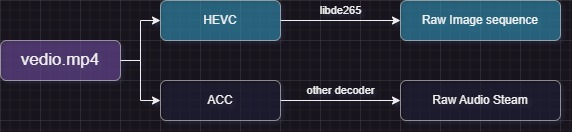

<div align="center">
  <p>
    <a href="https://github.com/Puiching-Memory/pylibde265" target="_blank">
      </a>
  </p>

<div>
    <a href=""></a>
    <br>
    <a href=""></a>
    <a href=""></a>
    <a href=""></a>
    <a href=""></a>
    <a href=""></a>
  </div>

  [中文](https://github.com/Puiching-Memory/pylibde265/blob/main/README_zh.md) | [English](https://github.com/Puiching-Memory/pylibde265/blob/main/README.md)

</div>

# pylibde265

python binding implementation of libde265, based on cython

libde265的Python绑定实现，基于cython

### Warning! This repository is still in early release, the code is subject to frequent disruptive changes, and we cannot guarantee compatibility with the current version

### 警告！此存储库仍处于早期版本，代码会经常有破坏性更改，我们无法保证目前版本的兼容性

# 概念

<div>
  <a href=""></a>
</div>

常见的视频文件，如.mp4是一类容器，其包含了视频流(HEVC编码)和音频流(ACC编码)数据。

libde265负责将HEVC编码的视频流解码至原始比特流，此类文件通常以.265或.hevc作为后缀名。

*目前版本中，不支持直接解码.mp4文件，你需要手动分离视频文件的视频部分，可以使用如ffmpeg的多媒体工具。

# 快速开始

running_example.py

```python
import pylibde265.pyde265
import PIL.Image
import cupy as cp 

print(pylibde265.pyde265.get_version())

vedio_path = r"D:\GitHub\pylibde265\multimedia\video\Kinkaku-ji.h265"
dec = pylibde265.pyde265.decode_decoder(10)

with open(vedio_path,'rb') as data:
    re = dec.load(data)
    frame = 0
    for re in dec.decode():
        frame += 1
        #print(re['pts'])
        #print(re['ttd'],re['ttd_max'])
        image_data = re['image']
        image_data = cp.asnumpy(image_data)
        image = PIL.Image.fromarray(image_data,mode='YCbCr')
        #image.save(f'./cache/{str(frame).zfill(9)}.jpg')
        image.show()
```


# 性能

目前，cython层的部分矩阵处理导致了延迟，4k视频下无法保持24帧正常播放。

| 分辨率 | FPS(libde265) | FPS(pylibde265) |
| ------ | ------------- | --------------- |
| 720p   | 284           |                 |
| 1080p  | 150           |                 |
| 4k     | 36            |                 |

线程性能分析：

| 线程 | 视频1-FPS | 视频2-FPS |
| ---- | --------- | --------- |
| 1    |           |           |
| 2    |           |           |

测试环境：

| CPU             | GPU       | 系统                  | 电源性能设置 | libde265 | pylibde265 |
| --------------- | --------- | --------------------- | ------------ | -------- | ---------- |
| intel@i5-12500H | RTX4060Ti | windows11(22631.3810) | 平衡         | 1.0.15   | 0.0.1a     |

# 从源代码构建

1. 下载存储库 `git clone https://github.com/Puiching-Memory/pylibde265.git`
2. 运行 `python tools_build.py`

环境需求

```python
cython
setuptools>=69.0
loguru
cupy-cuda12x
scipy
numpy
```

# 常见问题

Q:支持什么系统

A:目前只支持windows系统

# 贡献

# 版权

### 作者

@梦归云帆

### 鸣谢

* libde265 C/C++仓库 : 作者[@strukturag](https://github.com/strukturag/libde265)

### 标签来源

https://dev.to/envoy_/150-badges-for-github-pnk

https://shields.io/badges
