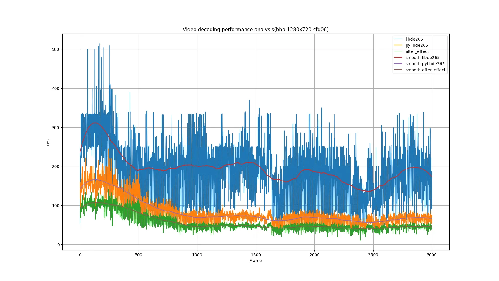

<div align="center">
  <p>
    <a href="https://github.com/Puiching-Memory/pylibde265" target="_blank">
      </a>
  </p>

<div>
    <a href=""></a>
    <br>
    <a href=""></a>
    <a href=""></a>
    <a href=""></a>
    <a href=""></a>
    <a href=""></a>
    <a href=""></a>
  </div>

  [中文](https://github.com/Puiching-Memory/pylibde265/blob/main/README_zh.md) | [English](https://github.com/Puiching-Memory/pylibde265/blob/main/README.md)

</div>

# pylibde265

Python binding of libde265 to implement HEVC video stream decoding

libde265的Python绑定，实现HEVC视频流解码

### Warning! This repository is still in early release, the code is subject to frequent disruptive changes, and we cannot guarantee compatibility with the current version

### 警告！此存储库仍处于早期版本，代码会经常有破坏性更改，我们无法保证目前版本的兼容性

# 概念

<div>
  <a href=""></a>
</div>

常见的视频文件，如.mp4是一类容器，其包含了视频流(HEVC编码)和音频流(ACC编码)数据。

libde265负责将HEVC编码的视频流解码至原始比特流，此类文件通常以.265或.hevc作为后缀名。

*目前版本中，不支持直接解码.mp4文件，你需要手动分离视频文件的视频部分，可以使用如ffmpeg的多媒体工具。

# 快速开始

running_example.py

```python
import pylibde265.pyde265
import PIL.Image
import cupy as cp 

print(pylibde265.pyde265.get_version())

vedio_path = r"D:\GitHub\pylibde265\multimedia\video\Kinkaku-ji.h265"
dec = pylibde265.pyde265.decode_decoder(10)

with open(vedio_path,'rb') as data:
    re = dec.load(data)
    frame = 0
    for re in dec.decode():
        frame += 1
        #print(re['pts'])
        #print(re['ttd'],re['ttd_max'])
        image_data = re['image']
        image_data = cp.asnumpy(image_data)
        image = PIL.Image.fromarray(image_data,mode='YCbCr')
        #image.save(f'./cache/{str(frame).zfill(9)}.jpg')
        image.show()
```

代码解释:

# 深入了解

* 在线文档(待建)

# 性能

* 目前，cython层的部分矩阵处理导致了延迟，4k视频下无法保持24帧正常播放。
* 总体测量下，当前版本性能损失在50%左右
* 性能最佳实践报告(待建)

| 分辨率 | 视频                                                                                 | FPS(libde265) | FPS(pylibde265) | FPS(后处理) |
| ------ | ------------------------------------------------------------------------------------ | ------------- | --------------- | ----------- |
| 720p   | [bbb-1280x720-cfg06](https://www.libde265.org/hevc-bitstreams/bbb-1280x720-cfg06.mkv)   | 195           | 83              | 56          |
| 1080p  | [bbb-1920x1080-cfg06](https://www.libde265.org/hevc-bitstreams/bbb-1920x1080-cfg06.mkv) | 101           | 47              | 29          |
| 4k     | [tos-4096x1720-tiles](https://www.libde265.org/hevc-bitstreams/tos-4096x1720-tiles.mkv) | 35            | 19              | 11          |



线程性能分析：

测试环境：

test/vis_performance.py

| 设置       | 状态 |
| ---------- | ---- |
| deblocking | off  |
| SAO        | off  |

| 分辨率 | 文件名              | 范围     |
| ------ | ------------------- | -------- |
| 4k     | tos-4096x1720-tiles | 前3000帧 |
| 1080p  | bbb-1920x1080-cfg06 | 前3000帧 |
| 720p   | bbb-1280x720-cfg06  | 前3000帧 |

| CPU             | GPU       | 系统                  | 电源性能设置 | libde265 | pylibde265 |
| --------------- | --------- | --------------------- | ------------ | -------- | ---------- |
| intel@i5-12500H | RTX4060Ti | windows11(22631.3810) | 平衡         | 1.0.15   | 0.0.1a     |

# 从源代码构建

1. 下载存储库 `git clone https://github.com/Puiching-Memory/pylibde265.git`
2. 依据本地构建清单配置环境
3. 安装编译器(Visual Studio 生成工具 2022 or Visual Studio 2022 C++开发套件)
4. 运行 `python tools_build.py`

环境需求-开发:

```
pip install -r requirements_dev.txt
git clone https://github.com/strukturag/libde265.git
cd libde265
mkdir build
cd build
cmake ..
cmake --build . --config Release
```

环境需求-使用:

```
cupy-cuda12x >= 13.2.0
scipy >= 1.14.0
numpy >= 2.0.0
```

环境需求-测试:

```
matplotlib >= 3.9.1
```

# 常见问题

| 问题Q        | 回答A                 | 日期     | 版本   |
| ------------ | --------------------- | -------- | ------ |
| 支持什么系统 | 目前只支持windows系统 | 2024.7.7 | 0.0.1a |
| 硬件要求     | 需要nvidia显卡(cupy)  | 2024.7.7 | 0.0.1a |

# 如何贡献

* 不接受来自gitee/gitlab等镜像站的合并请求

# 路线图

下一个版本:0.0.2

* [ ] 帧解码性能改进
* [ ] intel_GPU支持
* [ ] 流式加载数据(而不是在开始解码前完全载入)
* [ ] 可修改的设置项

# 后记

作者:

* @梦归云帆

鸣谢:

* [libde265](https://github.com/strukturag/libde265)--C/C++仓库:作者[@strukturag](https://github.com/strukturag)
* [pyde265](https://github.com/kloppjp/pyde265)--提供linux系统的py绑定:作者[@kloppjp](https://github.com/kloppjp)

统计数据标签:

* https://dev.to/envoy_/150-badges-for-github-pnk
* https://shields.io/

数据分析:

* https://pypistats.org/packages/pylibde265
