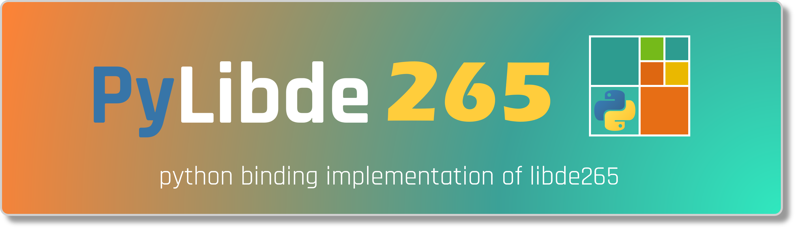
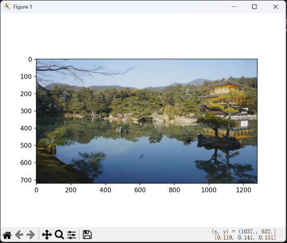

<div align="center">
  <p>
    <a href="https://github.com/Puiching-Memory/pylibde265" target="_blank">
      </a>
  </p>

<div>
    <a href=""></a>
    <a href=""></a>
    <a href=""></a>
    <br>
    <a href=""></a>
    <a href=""></a>
    <a href=""></a>
    <a href=""></a>
    <a href=""></a>
    <a href=""></a>
  </div>

  [中文](README_zh.md) | [English](README.md)

</div>

# pylibde265

在Python中解码HEVC(H.265)视频

### 警告！此存储库仍处于早期版本，代码会经常有破坏性更改，我们无法保证目前版本的兼容性

# 概念

<div>
  <a href=""></a>
</div>

常见的视频文件，如.mp4是一类容器，其包含了视频流(HEVC编码)和音频流(AAC编码)数据。

libde265负责将HEVC编码的视频流解码至原始比特流。

从 v0.1.0 开始，pylibde265 内置了轻量级的 MP4 解复用器，支持直接从 .mp4/.mov 文件中解码 HEVC 视频流。

# 快速开始

```bash
pip install pylibde265
```

```python
import pylibde265.de265
import matplotlib.pyplot as plt
import os

# 初始化解码器 (指定线程数)
dec = pylibde265.de265.decoder(threads=os.cpu_count() or 1)

# 流式加载并解码 HEVC (.265/.hevc) 文件
for img in dec.load_file("your_video.h265"):
    print(f"Frame PTS: {img.pts}, {img.width()}x{img.height()}")
    
    # 获取原始 YUV 分量 (numpy 视图，无拷贝)
    # y, cb, cr = img.yuv()
    
    # 转换为 RGB (C++ 层加速，支持 420/422/444 和 8-12bit)
    rgb = img.to_rgb()
    
    plt.imshow(rgb)
    plt.show()
    break
```



## 高级用法：内存流处理

如果你正在处理来自网络或内存的流数据：

```python
dec = pylibde265.de265.decoder()
with open("stream.h265", "rb") as f:
    while True:
        chunk = f.read(4096)
        if not chunk: break
        
        dec.push_data(chunk)
        for img in dec.decode():
             # 处理图像
             process(img.to_rgb())
```

## MP4 直接解码

```python
import pylibde265

demuxer = pylibde265.FileDemuxer("video.mp4")
decoder = pylibde265.decoder()

# 获取视频信息
print(f"帧率: {demuxer.get_fps()}, 总帧数: {len(demuxer)}")

# 使用包头 (VPS/SPS/PPS) 初始化
decoder.push_data(demuxer.get_headers())

# 遍历视频包
for frame_data in demuxer:
    decoder.push_data(frame_data)
    for img in decoder.decode():
        # 处理图像 (例如转换为 RGB)
        rgb = img.to_rgb()
```

# 更多示例

本项目在 `example/` 目录下提供了详细的示例代码，涵盖了从基础解码到可视化的各个方面：

*   **[01_basic_decoding.py](example/01_basic_decoding.py)**: 基础文件解码入门。
*   **[02_stream_decoding.py](example/02_stream_decoding.py)**: 内存/网络流数据处理。
*   **[03_metadata_config.py](example/03_metadata_config.py)**: 访问 PTS、分辨率、NAL Header 等元数据及参数配置。
*   **[04_image_processing.py](example/04_image_processing.py)**: 将帧保存为图像，访问原始 YUV 数据。
*   **[05_visualization.py](example/05_visualization.py)**: H.265 编码结构可视化（编码块、运动矢量等）。
*   **[06_mp4_decoding.py](example/06_mp4_decoding.py)**: 直接 MP4 文件解码示例。
*   **[07_visual_player.py](example/07_visual_player.py)**: 带有进度条和基于帧率同步播放的可视化播放器（使用 OpenCV 和 tqdm）。

详细说明请参考 [example/README.md](example/README.md)。

# 性能

* **高性能 C++ 核心**：所有的像素处理和颜色转换 (YUV to RGB) 已完全迁移至 C++ 层，利用 `pybind11` 实现零拷贝数据交换。
* **多线程支持**：充分利用 libde265 的多线程解码能力，在多核处理器上表现优异。
* **性能基准 (720p H.265)**：
    * **解码速度**: > 100 FPS (单帧耗时 ~8ms)。
    * **颜色转换**: ~6ms (C++ 加速，支持 4:2:0/4:2:2/4:4:4)。
    * **综合吞吐量**: 在 4 线程下可稳定达到 30+ FPS 的实时播放速率。

具体性能数据 (基于 `test/bench_performance.py`):

| 线程数 | 解码 (ms) | RGB 转换 (ms) | 综合 FPS |
| :----- | :-------- | :------------ | :------- |
| 1      | 73.18     | 6.20          | 12.6     |
| 4      | 27.64     | 5.72          | 30.0     |
| 16     | 22.19     | 5.79          | 35.7     |

# 从源代码构建

## 环境要求
- C++11 兼容编译器 (Windows: VS 2022 / GCC / Clang)
- CMake 3.15+
- Python 3.9+

## 使用 uv (推荐)

1. 克隆存储库：`git clone https://github.com/Puiching-Memory/pylibde265.git`
2. 安装依赖并自动构建：

```bash
# 创建并激活环境
uv venv
.venv\Scripts\activate

# 直接以开发模式安装 (会自动调用 CMake 编译 C++ 模块)
uv pip install -e .[dev]
```

## 运行测试

使用 `pytest` 进行标准化测试：

```bash
pytest test/
```

# 路线图

* [x] **高性能 C++ 颜色转换**：支持多种采样格式和位深。
* [x] **流式数据加载**：支持 `push_data` 实时解码。
* [x] **解复用器 (Demuxer)**：内置轻量级解复用器，支持标准 MP4 及 Fragmented MP4 (fMP4)。
* [ ] **硬件加速解码**：集成 DXVA2/D3D11VA。


# 致谢

作者:

* @梦归云帆

参考:

* [libde265](https://github.com/strukturag/libde265)--C/C++仓库:作者[@strukturag](https://github.com/strukturag)
* [pyde265](https://github.com/kloppjp/pyde265)--提供linux系统的py绑定:作者[@kloppjp](https://github.com/kloppjp)

统计数据标签:

* https://dev.to/envoy_/150-badges-for-github-pnk
* https://shields.io/

数据分析:

* https://pypistats.org/packages/pylibde265
